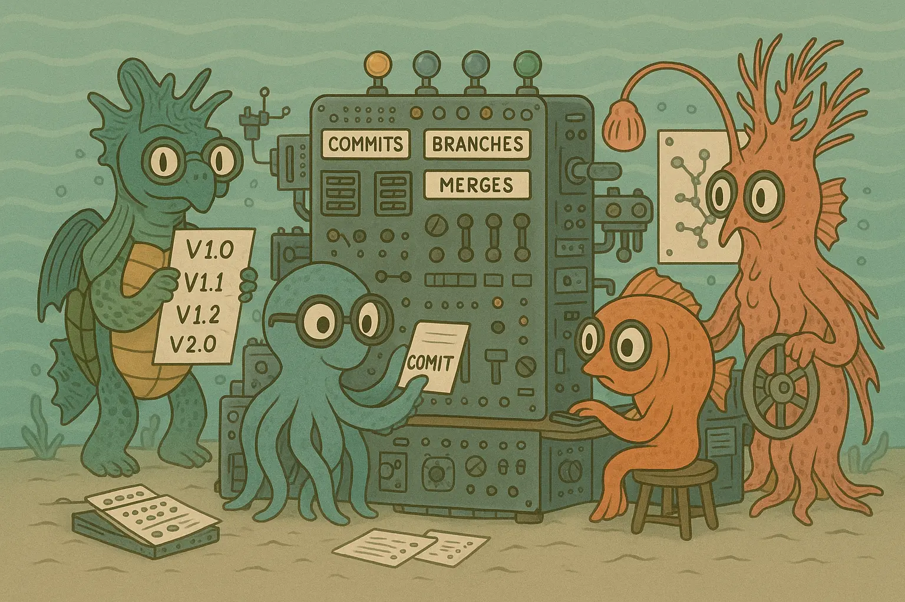

# Tide Version Control 🌊



**Tide** is a Git-compatible distributed version control system implemented in Ruby. It provides all the core functionality of Git with a clean, well-documented codebase that's perfect for understanding how version control systems work under the hood.

## 🚀 Features

- **Complete Git Compatibility**: Works with standard Git repositories and protocols
- **Full Version Control**: Track changes, branch, merge, and collaborate
- **Object Storage**: Efficient blob, tree, and commit object management
- **Index Management**: Stage files with a proper staging area
- **Remote Operations**: Push, pull, fetch from remote repositories
- **Merge Strategies**: Handle conflicts and different merge scenarios
- **Branch Management**: Create, switch, and manage branches
- **Network Protocol**: Compatible with Git's upload-pack and receive-pack

## 📋 Requirements

- Ruby 2.7 or higher
- Bundler gem manager

## 🛠 Installation

1. Clone the repository:
   ```bash
   git clone <repository-url>
   cd tide-version-control
   ```

2. Install dependencies:
   ```bash
   bundle install
   ```

3. Make the `tide` command executable:
   ```bash
   chmod +x bin/tide
   ```

4. Add to your PATH (optional):
   ```bash
   echo 'export PATH="$PATH:/path/to/tide-version-control/bin"' >> ~/.bashrc
   source ~/.bashrc
   ```

## 🎯 Usage

### Basic Commands

#### Initialize a Repository
```bash
./bin/tide init [directory]
```
Creates a new Tide repository in the specified directory (or current directory if omitted).

#### Add Files to Staging
```bash
./bin/tide add <file1> [file2] ...
./bin/tide add .  # Add all files
./bin/tide add directory/  # Add entire directory
```

#### Check Status
```bash
./bin/tide status
./bin/tide status --porcelain  # Machine-readable format
```

#### Commit Changes
```bash
./bin/tide commit -m "Your commit message"
./bin/tide commit  # Opens editor for commit message
```

#### View History
```bash
./bin/tide log
./bin/tide log --oneline
./bin/tide log --graph
```

#### Show Differences
```bash
./bin/tide diff  # Working directory vs staged
./bin/tide diff --staged  # Staged vs last commit
./bin/tide diff <commit1> <commit2>  # Between commits
```

### Branch Management

```bash
./bin/tide branch  # List branches
./bin/tide branch <branch-name>  # Create new branch
./bin/tide checkout <branch-name>  # Switch branches
./bin/tide checkout -b <branch-name>  # Create and switch
```

### Remote Operations

```bash
./bin/tide remote add origin <url>
./bin/tide fetch <remote>
./bin/tide push <remote> <branch>
```

### Advanced Operations

```bash
./bin/tide merge <branch>  # Merge branch
./bin/tide reset <commit>  # Reset to commit
./bin/tide revert <commit>  # Revert a commit
./bin/tide cherry-pick <commit>  # Cherry-pick commit
```

## 🏗 Architecture

Tide follows Git's architecture with these core components:

### Object Database (`lib/database.rb`)
- **Blobs**: Store file contents
- **Trees**: Represent directory structures  
- **Commits**: Capture snapshots with metadata
- Uses SHA-1 hashing for object identification
- Supports both loose objects and packed storage

### Index System (`lib/index.rb`)
- Staging area for preparing commits
- Tracks file metadata (mode, timestamps, checksums)
- Enables efficient diff operations

### Command System (`lib/command/`)
Modular command structure with dedicated classes for:
- `Init` - Repository initialization
- `Add` - File staging
- `Commit` - Creating snapshots
- `Status` - Working tree analysis
- `Branch`, `Checkout` - Branch management
- `Merge`, `Reset`, `Revert` - History manipulation
- `Push`, `Fetch` - Remote synchronization

### Repository (`lib/repository.rb`)
Central coordinator that manages:
- Workspace (working directory)
- Index (staging area)
- Database (object storage)
- References (branches, tags)

## 🧪 Testing

Run the test suite:

```bash
# Run all tests
bundle exec rake test

# Run specific test file
bundle exec ruby test/command/add_test.rb
```

Test coverage includes:
- Command functionality
- Object storage and retrieval
- Index operations
- Error handling
- Edge cases

## 🔧 Configuration

Tide uses Git-compatible configuration:

```bash
./bin/tide config user.name "Your Name"
./bin/tide config user.email "your.email@example.com"
./bin/tide config --list  # View all settings
```

Configuration is stored in `.git/config` using standard Git format.

## 📚 Learning Resources

This project is excellent for understanding:
- **Version Control Internals**: How Git stores and tracks changes
- **Object-Oriented Design**: Clean Ruby architecture
- **File System Operations**: Low-level file and directory management
- **Network Protocols**: Git's transport mechanisms
- **Algorithm Implementation**: Diff algorithms, merge strategies

---

*Tide - Ride the wave of version control! 🌊*

